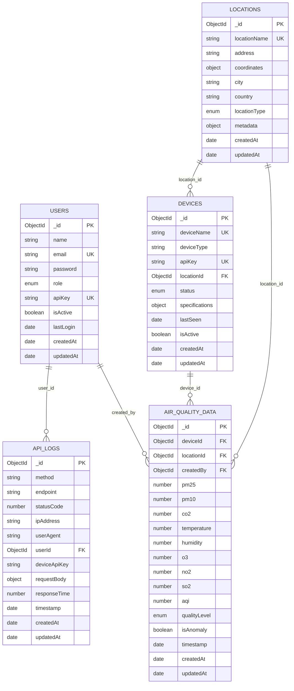
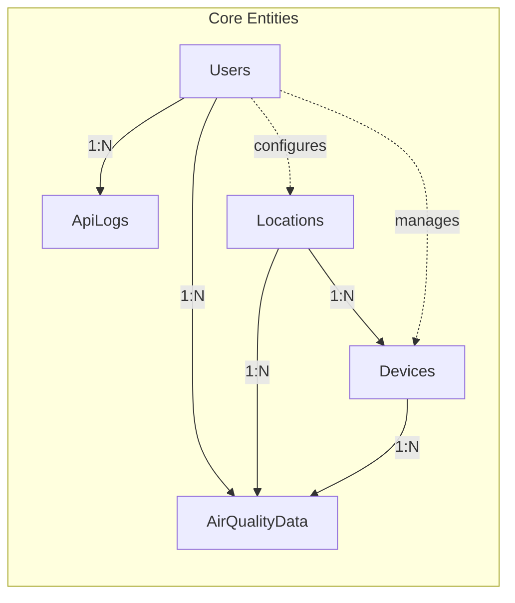
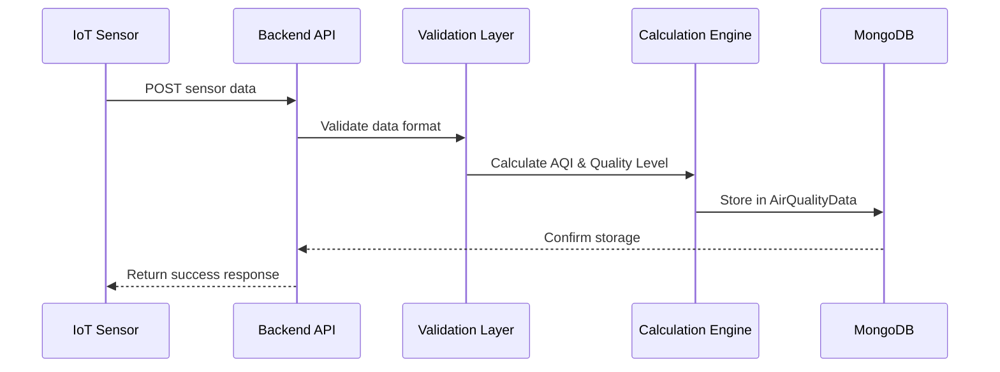
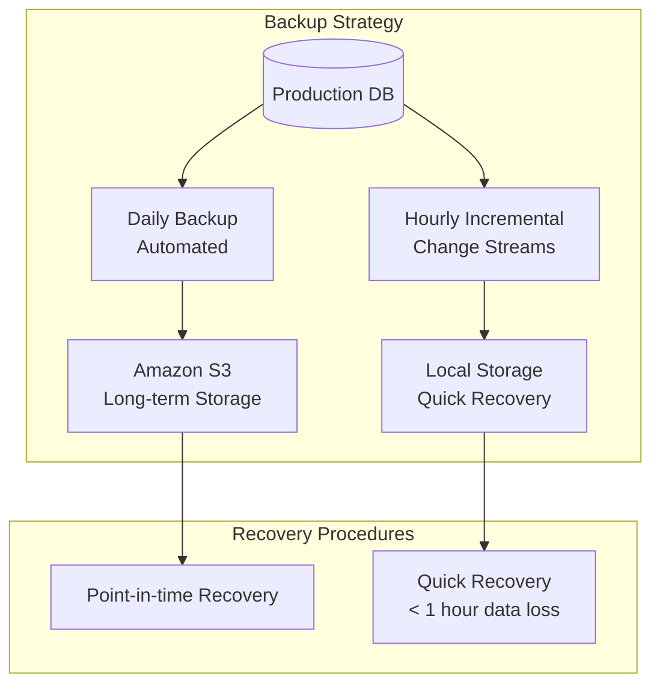

# Desain Database Schema - IoT Air Quality Dashboard

## Overview Database
Database menggunakan **MongoDB** dengan **Mongoose ODM** untuk mengelola data sensor IoT, user management, dan system logging.

## 1. Database Schema Overview



## 2. Detailed Collection Schemas

### 2.1 Users Collection
```javascript
// Model: backend/models/User.js
const userSchema = {
  _id: ObjectId,
  name: {
    type: String,
    required: true,
    trim: true,
    minlength: 2,
    maxlength: 50
  },
  email: {
    type: String,
    required: true,
    unique: true,
    lowercase: true,
    validate: [validator.isEmail, 'Invalid email format']
  },
  password: {
    type: String,
    required: true,
    minlength: 6,
    // Hashed using bcryptjs
  },
  role: {
    type: String,
    enum: ['user', 'admin', 'device'],
    default: 'user'
  },
  apiKey: {
    type: String,
    unique: true,
    sparse: true,
    // Auto-generated for API access
  },
  profile: {
    avatar: String,
    phone: String,
    department: String,
    position: String
  },
  preferences: {
    theme: {
      type: String,
      enum: ['light', 'dark', 'system'],
      default: 'system'
    },
    notifications: {
      email: { type: Boolean, default: true },
      push: { type: Boolean, default: true },
      alerts: { type: Boolean, default: true }
    },
    language: {
      type: String,
      default: 'en'
    }
  },
  isActive: {
    type: Boolean,
    default: true
  },
  lastLogin: Date,
  loginAttempts: {
    type: Number,
    default: 0
  },
  lockUntil: Date,
  passwordResetToken: String,
  passwordResetExpires: Date,
  createdAt: { type: Date, default: Date.now },
  updatedAt: { type: Date, default: Date.now }
}

// Indexes
userSchema.index({ email: 1 });
userSchema.index({ apiKey: 1 });
userSchema.index({ role: 1 });
userSchema.index({ isActive: 1 });
```

### 2.2 AirQualityData Collection
```javascript
// Model: backend/models/AirQualityData.js
const airQualityDataSchema = {
  _id: ObjectId,
  deviceId: {
    type: ObjectId,
    ref: 'Device',
    required: true,
    index: true
  },
  locationId: {
    type: ObjectId,
    ref: 'Location',
    required: true,
    index: true
  },
  createdBy: {
    type: ObjectId,
    ref: 'User',
    default: null
  },
  
  // Primary Air Quality Measurements
  measurements: {
    pm25: {
      type: Number,
      required: true,
      min: 0,
      max: 1000,
      unit: 'μg/m³'
    },
    pm10: {
      type: Number,
      required: true,
      min: 0,
      max: 1000,
      unit: 'μg/m³'
    },
    co2: {
      type: Number,
      required: true,
      min: 300,
      max: 5000,
      unit: 'ppm'
    },
    temperature: {
      type: Number,
      required: true,
      min: -50,
      max: 80,
      unit: '°C'
    },
    humidity: {
      type: Number,
      required: true,
      min: 0,
      max: 100,
      unit: '%'
    },
    o3: {
      type: Number,
      min: 0,
      max: 1000,
      unit: 'μg/m³'
    },
    no2: {
      type: Number,
      min: 0,
      max: 1000,
      unit: 'μg/m³'
    },
    so2: {
      type: Number,
      min: 0,
      max: 1000,
      unit: 'μg/m³'
    },
    co: {
      type: Number,
      min: 0,
      max: 50,
      unit: 'mg/m³'
    }
  },
  
  // Calculated Values
  aqi: {
    type: Number,
    min: 0,
    max: 500,
    index: true
  },
  qualityLevel: {
    type: String,
    enum: ['Good', 'Moderate', 'Unhealthy for Sensitive Groups', 'Unhealthy', 'Very Unhealthy', 'Hazardous'],
    index: true
  },
  
  // Data Quality & Status
  dataQuality: {
    isValid: { type: Boolean, default: true },
    isAnomaly: { type: Boolean, default: false },
    confidence: { type: Number, min: 0, max: 1, default: 1 },
    calibrationStatus: {
      type: String,
      enum: ['calibrated', 'needs_calibration', 'uncalibrated'],
      default: 'calibrated'
    }
  },
  
  // Metadata
  metadata: {
    sensorModel: String,
    firmwareVersion: String,
    batteryLevel: Number,
    signalStrength: Number,
    rawData: Object // Original sensor readings
  },
  
  timestamp: {
    type: Date,
    required: true,
    index: true
  },
  createdAt: { type: Date, default: Date.now },
  updatedAt: { type: Date, default: Date.now }
}

// Compound Indexes for efficient queries
airQualityDataSchema.index({ deviceId: 1, timestamp: -1 });
airQualityDataSchema.index({ locationId: 1, timestamp: -1 });
airQualityDataSchema.index({ qualityLevel: 1, timestamp: -1 });
airQualityDataSchema.index({ 'measurements.pm25': 1, timestamp: -1 });
airQualityDataSchema.index({ 'dataQuality.isAnomaly': 1, timestamp: -1 });

// TTL index to automatically delete old data (keep for 2 years)
airQualityDataSchema.index({ timestamp: 1 }, { expireAfterSeconds: 2 * 365 * 24 * 60 * 60 });
```

### 2.3 Devices Collection
```javascript
// Model: backend/models/Device.js
const deviceSchema = {
  _id: ObjectId,
  deviceName: {
    type: String,
    required: true,
    unique: true,
    trim: true
  },
  deviceType: {
    type: String,
    enum: ['air_quality_sensor', 'weather_station', 'indoor_monitor', 'outdoor_monitor'],
    required: true
  },
  apiKey: {
    type: String,
    unique: true,
    required: true,
    // Auto-generated for device authentication
  },
  locationId: {
    type: ObjectId,
    ref: 'Location',
    required: true
  },
  
  specifications: {
    manufacturer: String,
    model: String,
    firmwareVersion: String,
    hardwareVersion: String,
    serialNumber: { type: String, unique: true },
    supportedMeasurements: [String], // ['pm25', 'pm10', 'co2', 'temperature', 'humidity']
    accuracy: {
      pm25: Number,
      pm10: Number,
      co2: Number,
      temperature: Number,
      humidity: Number
    },
    operatingRange: {
      temperature: { min: Number, max: Number },
      humidity: { min: Number, max: Number },
      altitude: { min: Number, max: Number }
    }
  },
  
  status: {
    type: String,
    enum: ['active', 'inactive', 'maintenance', 'error', 'offline'],
    default: 'active',
    index: true
  },
  
  connectivity: {
    connectionType: {
      type: String,
      enum: ['wifi', 'ethernet', 'lora', 'cellular', 'bluetooth'],
      default: 'wifi'
    },
    lastSeen: { type: Date, index: true },
    ipAddress: String,
    macAddress: String,
    signalStrength: Number
  },
  
  maintenance: {
    lastCalibration: Date,
    nextCalibration: Date,
    calibrationInterval: Number, // days
    lastMaintenance: Date,
    nextMaintenance: Date,
    maintenanceNotes: [String]
  },
  
  configuration: {
    samplingInterval: { type: Number, default: 60 }, // seconds
    reportingInterval: { type: Number, default: 300 }, // seconds
    alertThresholds: {
      pm25: { warning: Number, critical: Number },
      pm10: { warning: Number, critical: Number },
      co2: { warning: Number, critical: Number },
      temperature: { min: Number, max: Number },
      humidity: { min: Number, max: Number }
    }
  },
  
  isActive: { type: Boolean, default: true },
  createdAt: { type: Date, default: Date.now },
  updatedAt: { type: Date, default: Date.now }
}

// Indexes
deviceSchema.index({ apiKey: 1 });
deviceSchema.index({ locationId: 1 });
deviceSchema.index({ status: 1 });
deviceSchema.index({ 'connectivity.lastSeen': -1 });
```

### 2.4 Locations Collection
```javascript
// Model: backend/models/Location.js
const locationSchema = {
  _id: ObjectId,
  locationName: {
    type: String,
    required: true,
    unique: true,
    trim: true
  },
  address: {
    street: String,
    city: { type: String, required: true },
    state: String,
    country: { type: String, required: true },
    postalCode: String,
    fullAddress: String
  },
  coordinates: {
    type: {
      type: String,
      enum: ['Point'],
      default: 'Point'
    },
    coordinates: {
      type: [Number], // [longitude, latitude]
      required: true,
      index: '2dsphere'
    },
    altitude: Number
  },
  locationType: {
    type: String,
    enum: ['indoor', 'outdoor', 'industrial', 'residential', 'commercial', 'office'],
    required: true
  },
  environment: {
    zone: {
      type: String,
      enum: ['urban', 'suburban', 'rural', 'industrial']
    },
    proximityToRoad: Number, // meters
    proximityToIndustry: Number, // meters
    buildingType: String,
    floorLevel: Number,
    roomType: String
  },
  metadata: {
    description: String,
    timezone: String,
    operatingHours: {
      start: String, // "08:00"
      end: String,   // "18:00"
      days: [String] // ["monday", "tuesday", ...]
    },
    capacity: Number, // max occupancy for indoor locations
    ventilationSystem: {
      type: String,
      enum: ['natural', 'mechanical', 'hvac', 'none']
    }
  },
  isActive: { type: Boolean, default: true },
  createdAt: { type: Date, default: Date.now },
  updatedAt: { type: Date, default: Date.now }
}

// Indexes
locationSchema.index({ coordinates: '2dsphere' });
locationSchema.index({ locationType: 1 });
locationSchema.index({ 'address.city': 1 });
```

### 2.5 ApiLogs Collection
```javascript
// Model: backend/models/ApiLog.js
const apiLogSchema = {
  _id: ObjectId,
  method: {
    type: String,
    required: true,
    enum: ['GET', 'POST', 'PUT', 'DELETE', 'PATCH', 'OPTIONS', 'HEAD'],
    uppercase: true
  },
  endpoint: {
    type: String,
    required: true,
    trim: true,
    maxlength: 500
  },
  statusCode: {
    type: Number,
    required: true,
    min: 100,
    max: 599
  },
  ipAddress: {
    type: String,
    required: true,
    trim: true
  },
  userAgent: {
    type: String,
    trim: true,
    maxlength: 1000
  },
  userId: {
    type: ObjectId,
    ref: 'User',
    default: null
  },
  deviceApiKey: {
    type: String,
    default: null
  },
  requestBody: {
    type: Object,
    default: null
  },
  responseTime: {
    type: Number, // milliseconds
    min: 0
  },
  timestamp: {
    type: Date,
    default: Date.now,
    required: true,
    index: true
  },
  referer: {
    type: String,
    trim: true
  },
  requestSize: {
    type: Number,
    min: 0
  },
  responseSize: {
    type: Number,
    min: 0
  },
  createdAt: { type: Date, default: Date.now },
  updatedAt: { type: Date, default: Date.now }
}

// Indexes for efficient queries
apiLogSchema.index({ timestamp: -1 });
apiLogSchema.index({ endpoint: 1, timestamp: -1 });
apiLogSchema.index({ statusCode: 1, timestamp: -1 });
apiLogSchema.index({ userId: 1, timestamp: -1 });
apiLogSchema.index({ ipAddress: 1, timestamp: -1 });

// TTL index - auto-delete logs older than 90 days
apiLogSchema.index({ timestamp: 1 }, { expireAfterSeconds: 90 * 24 * 60 * 60 });
```

## 3. Database Relationships



## 4. Data Flow & Storage Strategy

### 4.1 Data Ingestion Flow


### 4.2 Data Retention Policy
- **AirQualityData**: 2 years (TTL index)
- **ApiLogs**: 90 days (TTL index)
- **Users**: Permanent (soft delete)
- **Devices**: Permanent
- **Locations**: Permanent

### 4.3 Performance Optimization
- **Sharding**: By locationId for horizontal scaling
- **Replica Set**: 3-node cluster for high availability
- **Indexes**: Compound indexes for time-series queries
- **Aggregation Pipeline**: Pre-calculated statistics
- **Caching**: Redis for frequently accessed data

## 5. Sample Data Structures

### Sample AirQualityData Document
```json
{
  "_id": "ObjectId('...')",
  "deviceId": "ObjectId('...')",
  "locationId": "ObjectId('...')",
  "measurements": {
    "pm25": 15.2,
    "pm10": 23.1,
    "co2": 420,
    "temperature": 22.5,
    "humidity": 65,
    "o3": 80,
    "no2": 25,
    "so2": 10
  },
  "aqi": 52,
  "qualityLevel": "Moderate",
  "dataQuality": {
    "isValid": true,
    "isAnomaly": false,
    "confidence": 0.95,
    "calibrationStatus": "calibrated"
  },
  "metadata": {
    "sensorModel": "PMS7003",
    "firmwareVersion": "1.2.3",
    "batteryLevel": 85,
    "signalStrength": -45
  },
  "timestamp": "2024-01-15T10:30:00.000Z",
  "createdAt": "2024-01-15T10:30:15.000Z",
  "updatedAt": "2024-01-15T10:30:15.000Z"
}
```

## 6. Database Backup & Recovery Strategy



---

**Database ini dirancang untuk:**
- ✅ High-performance time-series data storage
- ✅ Real-time data ingestion dari multiple sensors
- ✅ Scalable architecture untuk growth
- ✅ Data integrity dan validation
- ✅ Comprehensive logging dan monitoring
- ✅ Flexible location dan device management