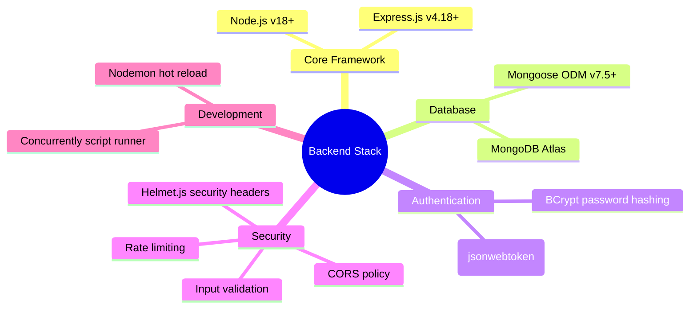
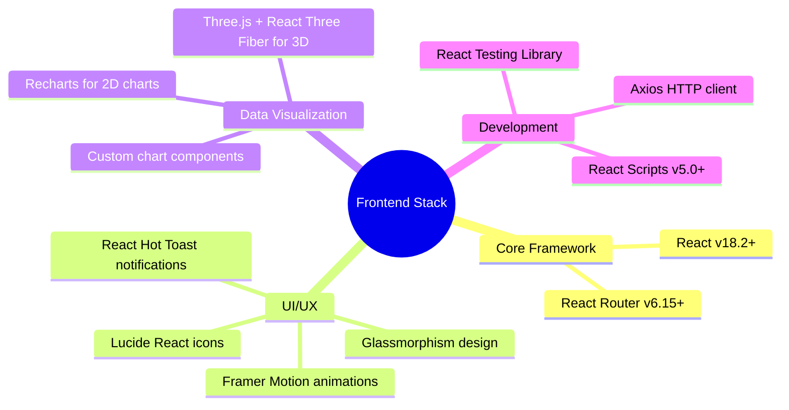
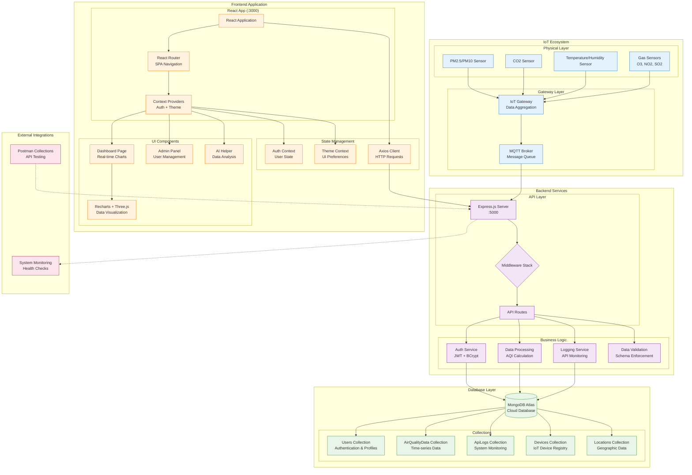
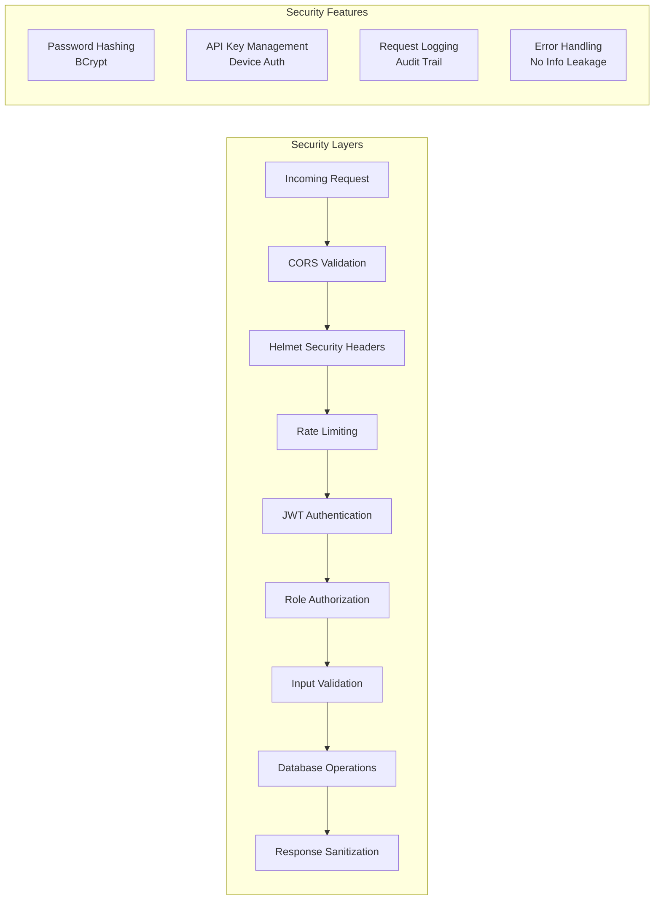
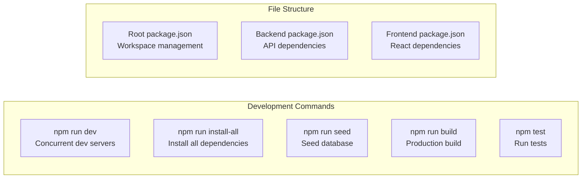
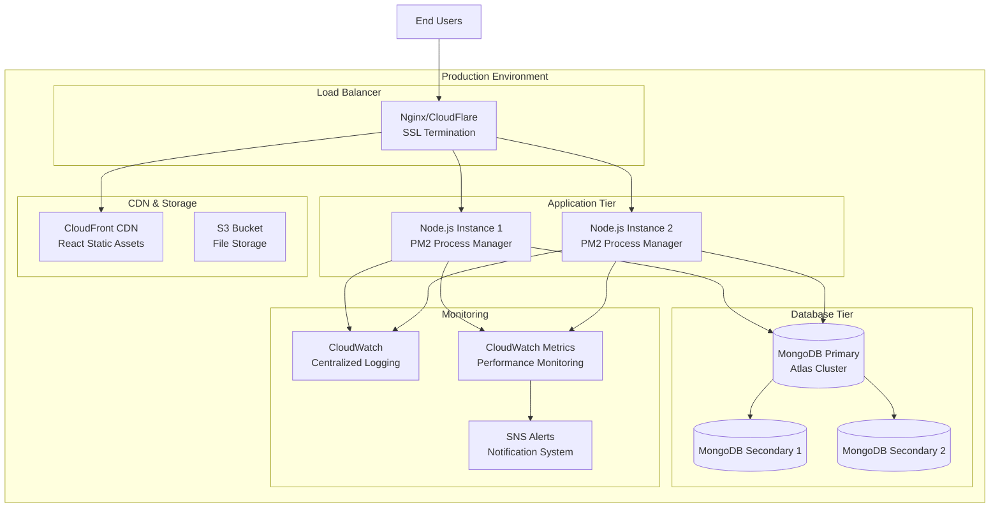

# Analisis Lengkap Proyek IoT Air Quality Dashboard

## Executive Summary
Proyek ini adalah **Ultimate Full-Stack MERN Application** untuk monitoring kualitas udara IoT di lingkungan korporat dengan arsitektur modern dan fitur-fitur canggih.

## 1. Struktur Proyek Saat Ini

```
iot-air-quality-dashboard/
├── 📁 backend/                    # Node.js + Express API Server
│   ├── 📄 server.js               # Entry point server
│   ├── 📄 package.json            # Backend dependencies
│   ├── 📁 middleware/             # Custom middleware
│   │   ├── auth.js                # JWT authentication
│   │   └── logging.js             # Request logging
│   ├── 📁 models/                 # MongoDB Mongoose models
│   │   ├── AirQualityData.js      # Sensor data model
│   │   ├── User.js                # User management model
│   │   └── ApiLog.js              # API logging model
│   ├── 📁 routes/                 # API route handlers
│   │   ├── auth.js                # Authentication routes
│   │   ├── data.js                # Sensor data CRUD
│   │   ├── users.js               # User management
│   │   └── admin.js               # Admin functions
│   └── 📁 scripts/
│       └── seedData.js            # Database seeding
├── 📁 frontend/                   # React.js Dashboard
│   ├── 📄 package.json            # Frontend dependencies
│   ├── 📁 public/                 # Static assets
│   ├── 📁 src/
│   │   ├── 📄 App.js              # Main app component
│   │   ├── 📄 index.js            # React entry point
│   │   ├── 📁 components/         # Reusable components
│   │   │   ├── AirQualityChart.js         # Chart visualizations
│   │   │   ├── AirQualityVisualization.js # 3D graphics
│   │   │   ├── DataTable.js               # Data grid
│   │   │   ├── DeviceStatus.js            # Device monitoring
│   │   │   ├── KPICard.js                 # Metrics cards
│   │   │   ├── Layout.js                  # App layout
│   │   │   ├── LoadingSpinner.js          # Loading states
│   │   │   └── ProtectedRoute.js          # Route protection
│   │   ├── 📁 contexts/           # React contexts
│   │   │   ├── AuthContext.js             # Authentication state
│   │   │   └── ThemeContext.js            # Theme management
│   │   ├── 📁 pages/              # Main pages
│   │   │   ├── DashboardPage.js           # Main dashboard
│   │   │   ├── LoginPage.js               # Authentication
│   │   │   ├── ProfilePage.js             # User profile
│   │   │   ├── AiHelperPage.js            # AI assistant
│   │   │   ├── UserManagementPage.js      # Admin users
│   │   │   ├── ApiLogPage.js              # System logs
│   │   │   └── NotFoundPage.js            # 404 handling
│   │   └── 📁 styles/             # CSS styling
│   │       ├── App.css                    # Global styles
│   │       └── glassmorphism.css          # Modern UI effects
├── 📁 postman/                   # API Testing Collections
│   ├── IoT_Dashboard_Testing.postman_collection.json
│   └── IoT_Dashboard_V3_Complete.postman_collection.json
├── 📄 package.json               # Root package manager
├── 📄 setup.sh                   # Installation script
└── 📄 README.md                  # Project documentation
```

## 2. Technology Stack Analysis

### Backend Technologies


### Frontend Technologies


## 3. Fitur-Fitur Utama yang Sudah Diimplementasi

### 3.1 Dashboard Real-time
- ✅ **Live Air Quality Monitoring**: Chart real-time untuk PM2.5, PM10, CO2, temperature, humidity
- ✅ **3D Visualization**: Visualisasi 3D menggunakan Three.js
- ✅ **KPI Cards**: Metrics cards dengan animasi
- ✅ **Device Status Monitoring**: Status perangkat IoT
- ✅ **Data Tables**: Tabel data sensor dengan filtering

### 3.2 User Management System
- ✅ **Authentication**: Login/logout dengan JWT
- ✅ **Role-based Access**: Admin vs regular user roles
- ✅ **User Profiles**: Profile management
- ✅ **Protected Routes**: Route protection berdasarkan authentication

### 3.3 Admin Panel
- ✅ **User Management**: CRUD operations untuk users
- ✅ **API Logging**: Comprehensive API request logging
- ✅ **System Monitoring**: API usage statistics dan error tracking

### 3.4 Advanced Features
- ✅ **AI Helper Page**: Halaman AI assistant (framework ready)
- ✅ **Theme System**: Light/dark theme dengan context
- ✅ **Responsive Design**: Mobile-friendly glassmorphism UI
- ✅ **Error Handling**: Comprehensive error boundaries
- ✅ **Loading States**: Loading spinners dan skeleton screens

## 4. Data Flow Architecture Lengkap



## 5. API Endpoints yang Sudah Diimplementasi

### Authentication Routes (`/api/auth`)
```javascript
POST   /api/auth/register     // User registration
POST   /api/auth/login        // User login
GET    /api/auth/me           // Get current user
PUT    /api/auth/profile      // Update user profile
POST   /api/auth/logout       // Logout user
```

### Data Routes (`/api/data`)
```javascript
GET    /api/data              // Get all sensor data (paginated)
POST   /api/data              // Create new sensor reading
GET    /api/data/:id          // Get specific reading
PUT    /api/data/:id          // Update reading
DELETE /api/data/:id          // Delete reading
GET    /api/data/latest       // Get latest readings
GET    /api/data/stats        // Get aggregated statistics
GET    /api/data/export       // Export data (CSV/JSON)
```

### User Management Routes (`/api/users`)
```javascript
GET    /api/users             // Get all users (admin only)
GET    /api/users/:id         // Get specific user
PUT    /api/users/:id         // Update user
DELETE /api/users/:id         // Delete user
PUT    /api/users/:id/role    // Update user role
```

### Admin Routes (`/api/admin`)
```javascript
GET    /api/admin/logs        // Get API logs
GET    /api/admin/stats       // System statistics
GET    /api/admin/health      // Health check
POST   /api/admin/seed        // Seed database
```

## 6. Database Schema yang Sudah Diimplementasi

### Current Models:
1. **User Model** - Complete with authentication, roles, profiles
2. **AirQualityData Model** - Comprehensive sensor data storage
3. **ApiLog Model** - Complete API monitoring and logging

### Missing Models (Recommended):
4. **Device Model** - IoT device registry and management
5. **Location Model** - Geographic and spatial data
6. **Alert Model** - Notification and alerting system
7. **Calibration Model** - Sensor calibration tracking

## 7. Security Implementation



## 8. Performance Optimizations

### Backend Optimizations:
- ✅ **Database Indexes**: Compound indexes untuk time-series queries
- ✅ **TTL Indexes**: Auto-deletion untuk old logs
- ✅ **Mongoose Virtuals**: Computed fields
- ✅ **Rate Limiting**: API protection
- ✅ **Request Logging**: Performance monitoring

### Frontend Optimizations:
- ✅ **Code Splitting**: Dynamic imports dengan React Router
- ✅ **Context Optimization**: Efficient state management
- ✅ **Component Optimization**: Memoization dan lazy loading
- ✅ **Asset Optimization**: Optimized build dengan React Scripts

## 9. Development Workflow



## 10. Deployment Architecture (Recommended)



---

## Kesimpulan & Next Steps

### ✅ Yang Sudah Selesai:
1. **Complete MERN Stack** implementation
2. **Authentication & Authorization** system
3. **Real-time Dashboard** dengan visualisasi canggih
4. **Admin Panel** untuk user management
5. **API Logging & Monitoring** system
6. **Responsive UI** dengan glassmorphism design
7. **Development Workflow** yang optimize

### 🚀 Recommended Enhancements:
1. **Device Management** - Implement Device dan Location models
2. **Real-time WebSocket** - Live data streaming
3. **Alert System** - Threshold-based notifications
4. **AI Integration** - Implement AI helper functionality
5. **Data Analytics** - Advanced reporting dan insights
6. **Mobile App** - React Native companion app
7. **Edge Computing** - IoT gateway optimization

Proyek ini sudah memiliki **foundation yang sangat solid** untuk sistem IoT monitoring kualitas udara enterprise-grade!