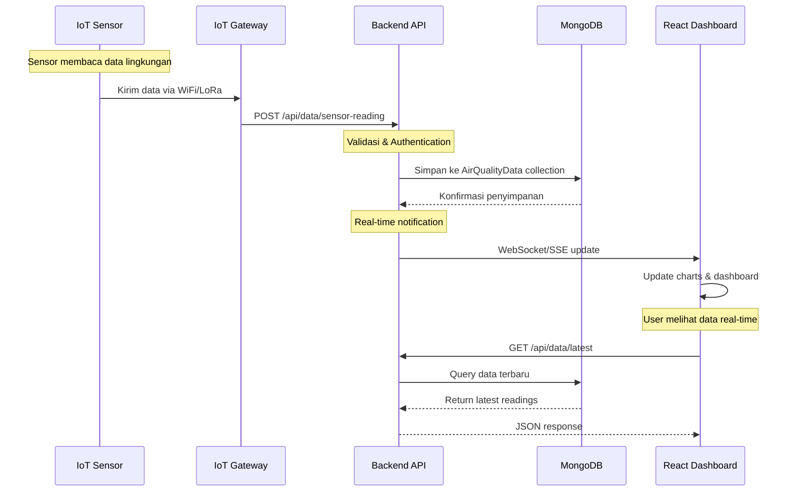
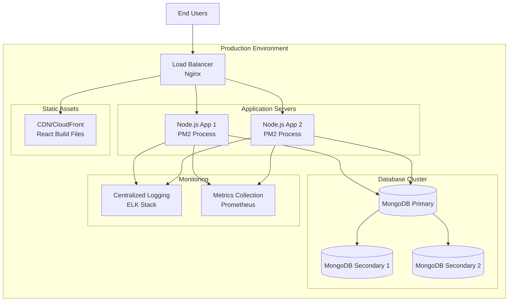

# Perancangan Arsitektur Sistem IoT Air Quality Dashboard

## Overview Proyek
Dashboard IoT untuk monitoring kualitas udara berbasis MERN Stack (MongoDB, Express.js, React, Node.js) dengan fitur real-time monitoring, user management, dan AI helper.

## 1. Arsitektur Sistem - Alur Kerja dari Sensor hingga Web

```mermaid
graph TB
    %% IoT Sensors Layer
    subgraph "IoT Sensors Layer"
        S1[Air Quality Sensor 1<br/>PM2.5, PM10, CO2, etc.]
        S2[Air Quality Sensor 2<br/>Temperature, Humidity]
        S3[Air Quality Sensor N<br/>O3, NO2, SO2]
    end
    
    %% Data Collection Layer
    subgraph "Data Collection & Gateway"
        GW[IoT Gateway<br/>Data Aggregation]
        MQTT[MQTT Broker<br/>Message Queue]
    end
    
    %% Backend Services Layer
    subgraph "Backend Services (Node.js/Express)"
        API[REST API Server<br/>Port: 5000]
        AUTH[Authentication<br/>JWT Middleware]
        RATE[Rate Limiting<br/>Security Layer]
        LOG[Logging Middleware<br/>API Monitoring]
    end
    
    %% Database Layer
    subgraph "Database Layer (MongoDB)"
        DB[(MongoDB Database)]
        subgraph "Collections"
            USERS[Users Collection<br/>Authentication & Roles]
            AIRDATA[AirQualityData Collection<br/>Sensor Readings]
            APILOGS[ApiLogs Collection<br/>System Monitoring]
        end
    end
    
    %% Frontend Layer
    subgraph "Frontend (React)"
        WEB[Web Dashboard<br/>Port: 3000]
        subgraph "React Components"
            DASH[Dashboard Page<br/>Real-time Charts]
            VIZ[Data Visualization<br/>3D Graphics]
            ADMIN[Admin Panel<br/>User Management]
            AI[AI Helper Page<br/>Data Analysis]
        end
    end
    
    %% External Services
    subgraph "External Services"
        POSTMAN[Postman Collections<br/>API Testing]
        NGINX[Nginx (Production)<br/>Reverse Proxy]
    end
    
    %% Data Flow
    S1 --> GW
    S2 --> GW
    S3 --> GW
    GW --> MQTT
    MQTT --> API
    
    API --> AUTH
    AUTH --> RATE
    RATE --> LOG
    
    API <--> DB
    DB --> USERS
    DB --> AIRDATA
    DB --> APILOGS
    
    WEB --> API
    WEB --> DASH
    WEB --> VIZ
    WEB --> ADMIN
    WEB --> AI
    
    POSTMAN -.-> API
    NGINX --> WEB
    NGINX --> API
    
    %% Real-time connections
    API -.->|WebSocket/SSE| WEB
    
    classDef sensor fill:#e1f5fe
    classDef backend fill:#f3e5f5
    classDef database fill:#e8f5e8
    classDef frontend fill:#fff3e0
    classDef external fill:#fce4ec
    
    class S1,S2,S3,GW,MQTT sensor
    class API,AUTH,RATE,LOG backend
    class DB,USERS,AIRDATA,APILOGS database
    class WEB,DASH,VIZ,ADMIN,AI frontend
    class POSTMAN,NGINX external
```

## 2. Arsitektur Detail Backend API

```mermaid
graph LR
    subgraph "Client Requests"
        CLIENT[Web Dashboard<br/>IoT Devices<br/>Mobile Apps]
    end
    
    subgraph "Express.js Server"
        CORS[CORS Middleware]
        HELMET[Helmet Security]
        RATE_LIMIT[Rate Limiting]
        AUTH_MW[JWT Auth Middleware]
        LOG_MW[Logging Middleware]
        
        subgraph "API Routes"
            AUTH_ROUTE[/api/auth<br/>Login/Register]
            DATA_ROUTE[/api/data<br/>Sensor Data CRUD]
            USER_ROUTE[/api/users<br/>User Management]
            ADMIN_ROUTE[/api/admin<br/>Admin Functions]
        end
    end
    
    subgraph "Controllers & Logic"
        AUTH_CTRL[Auth Controller<br/>JWT Generation]
        DATA_CTRL[Data Controller<br/>CRUD Operations]
        USER_CTRL[User Controller<br/>Profile Management]
        ADMIN_CTRL[Admin Controller<br/>System Management]
    end
    
    CLIENT --> CORS
    CORS --> HELMET
    HELMET --> RATE_LIMIT
    RATE_LIMIT --> AUTH_MW
    AUTH_MW --> LOG_MW
    
    LOG_MW --> AUTH_ROUTE
    LOG_MW --> DATA_ROUTE
    LOG_MW --> USER_ROUTE
    LOG_MW --> ADMIN_ROUTE
    
    AUTH_ROUTE --> AUTH_CTRL
    DATA_ROUTE --> DATA_CTRL
    USER_ROUTE --> USER_CTRL
    ADMIN_ROUTE --> ADMIN_CTRL
```

## 3. Flow Data Real-time



## 4. Komponen Teknologi

### Backend Stack
- **Node.js + Express.js**: REST API Server
- **MongoDB + Mongoose**: Database & ODM
- **JWT**: Authentication & Authorization
- **Helmet**: Security middleware
- **CORS**: Cross-origin resource sharing
- **Rate Limiting**: API protection
- **BCrypt**: Password hashing

### Frontend Stack
- **React 18**: UI Framework
- **React Router**: Client-side routing
- **Recharts**: Data visualization
- **Three.js + React Three Fiber**: 3D graphics
- **Framer Motion**: Animations
- **Axios**: HTTP client
- **React Hot Toast**: Notifications

### DevOps & Tools
- **Concurrently**: Run multiple npm scripts
- **Nodemon**: Development hot reload
- **Postman**: API testing collections
- **Git**: Version control

## 5. Security Architecture

```mermaid
graph TD
    subgraph "Security Layers"
        A[Client Request] --> B[CORS Policy]
        B --> C[Helmet Security Headers]
        C --> D[Rate Limiting]
        D --> E[JWT Authentication]
        E --> F[Role-based Authorization]
        F --> G[Input Validation]
        G --> H[Database Access]
    end
    
    subgraph "Authentication Flow"
        I[Login Request] --> J[Verify Credentials]
        J --> K[Generate JWT Token]
        K --> L[Return Token to Client]
        L --> M[Include Token in Headers]
        M --> N[Verify Token on Each Request]
    end
```



---

# Deployment Architecture (Production)


## 6. Desain Model Data MongoDB

| Koleksi            | Tujuan                                    | Field Utama                                                                                           |
|--------------------|-------------------------------------------|--------------------------------------------------------------------------------------------------------|
| `users`            | Menyimpan akun pengguna & hak akses       | `_id`, `name`, `email`, `password`, `role`, `deviceApiKey`, `deviceApiKeyStatus`, `lastLogin`, `isActive` |
| `airqualitydatas`  | Log pembacaan sensor per perangkat        | `_id`, `owner`, `deviceId`, `pm25`, `pm10`, `temperature`, `humidity`, `co2`, `voc`, `aqi`, `timestamp`   |
| `apilogs`          | Observabilitas API & audit trail          | `_id`, `method`, `endpoint`, `statusCode`, `responseTime`, `userId`, `deviceApiKey`, `timestamp`         |
| `alertnotifications` *(opsional)* | Notifikasi alert             | `_id`, `owner`, `deviceId`, `aqi`, `threshold`, `status`, `timestamp`, `channel`                        |

- **Relasi utama**: `airqualitydatas.owner` mengacu ke `_id` pada koleksi `users`.
- **Indeks penting**: kombinasi `(owner, deviceId, timestamp)` untuk query dashboard & analitik, serta indeks TTL (opsional) untuk data log lama.
- **Virtuals**: `airqualitydatas` memiliki virtual seperti `airQualityCategory`, `healthRecommendation`, `dataAge` untuk UI.

## 7. Spesifikasi API Utama

### Autentikasi & Otorisasi
- `POST /api/auth/login` – Login pengguna dan mengembalikan JWT.
- `POST /api/auth/validate-token` – Validasi token (digunakan SPA).
- `POST /api/auth/logout` – Pencatatan logout & revoke opsional.

### Data Sensor
- `POST /api/data` – Submit data sensor (device API key).
- `GET /api/data/latest` – Dapat menerima `userId`, `ownerId`, `deviceId`, `includeOwner` (khusus admin) untuk inspeksi lintas pengguna.
- `GET /api/data` – Pagination & filter (`startDate`, `endDate`, `deviceId`, `userId/ownerId`).
- `GET /api/data/charts` – `hours`, `type`, `userId` untuk grafik trend.
- `GET /api/data/alerts` – `threshold`, `hours`, `userId` untuk daftar alert.

### Manajemen Pengguna
- `GET /api/users/me` – Profil pengguna aktif.
- `GET /api/users/me/devices` – Daftar perangkat dengan statistik terakhir, mendukung `userId` untuk admin.
- `POST /api/users/me/api-key/reveal` – Menampilkan device API key.

### Endpoint Admin
- `GET /api/admin/users` – Pagination daftar user + statistik.
- `DELETE /api/admin/data/all` – Utility pembersihan data (untuk QA).
- Dashboard admin SPA memanfaatkan parameter `userId` di setiap endpoint data.

## 8. Fitur Dashboard Admin (Baru)

1. **Daftar Pengguna**
   - Panel kiri menampilkan seluruh user dengan status aktif, jumlah device, dan total readings.
   - Pencarian real-time berdasarkan nama atau email.
   - Tombol refresh untuk sinkronisasi dengan backend `GET /api/admin/users`.

2. **Panel Analitik Per-User**
   - Setelah memilih user, dashboard memuat:
     - `GET /api/data/latest?userId=...&includeOwner=true` untuk kartu AQI terkini.
     - `GET /api/data/charts?userId=...` untuk grafik tren 24 jam.
     - `GET /api/users/me/devices?userId=...` untuk status perangkat.
     - `GET /api/data?limit=10&userId=...` untuk tabel pembacaan terbaru.
     - `GET /api/data/alerts?userId=...` untuk daftar alert.
   - Admin dapat refresh data secara manual tanpa mengganti user.

3. **Kontrol Keamanan**
   - Middleware backend memverifikasi `userId` hanya boleh digunakan admin.
   - Respons API menyertakan `meta.adminView` untuk menandai view lintas pengguna.
   - DataTable dan komponen lain menerima prop `userId` agar query terisolasi.

## 9. Pertimbangan Skalabilitas

- **Sharding MongoDB** (future): membagi koleksi `airqualitydatas` berdasarkan `owner` atau `deviceId`.
- **Message Broker**: Integrasi MQTT/Apache Kafka untuk ingest massal dan streaming alert.
- **Caching**: Redis untuk menyimpan agregasi statistik & latest reading populer.
- **Horizontal Scaling**: PM2 cluster / Docker Swarm / Kubernetes untuk Node.js + autoscaling.
- **Observability**: Integrasi Prometheus + Grafana, serta tracing (OpenTelemetry) untuk memonitor latensi.

## 10. Roadmap Pengembangan

| Tahap | Fokus Utama | Deliverables |
|-------|-------------|--------------|
| Sprint 1 | Stabilitas Data Sensor | Validasi perangkat, logging API, retry connection MongoDB |
| Sprint 2 | Admin Experience | Admin dashboard multi-user, filtering devicestream, bulk data ops |
| Sprint 3 | Alerting & Notifikasi | Threshold configurator, email/SMS/Telegram alert, audit log |
| Sprint 4 | AI & Insight | Integrasi AI helper, rekomendasi kesehatan, anomaly detection |
| Sprint 5 | Deployment Production | CI/CD pipeline, monitoring, keamanan, dokumentasi operasional |

---

Dokumen ini akan terus diperbarui seiring bertambahnya fitur (misal integrasi AI helper lanjutan, data science pipeline, atau edge computing untuk gateway).
